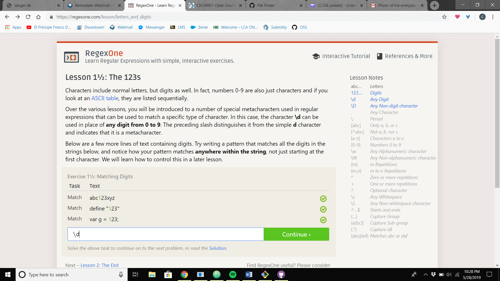
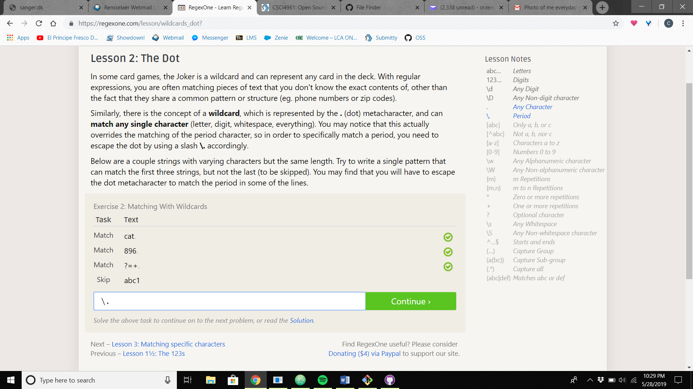
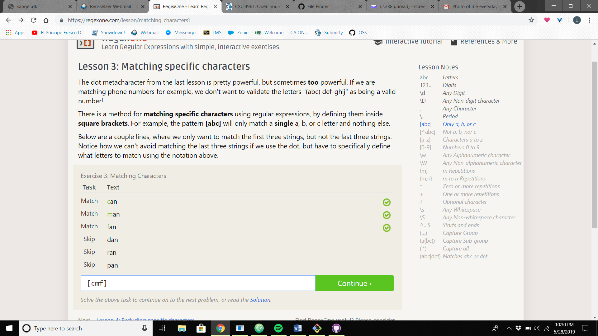
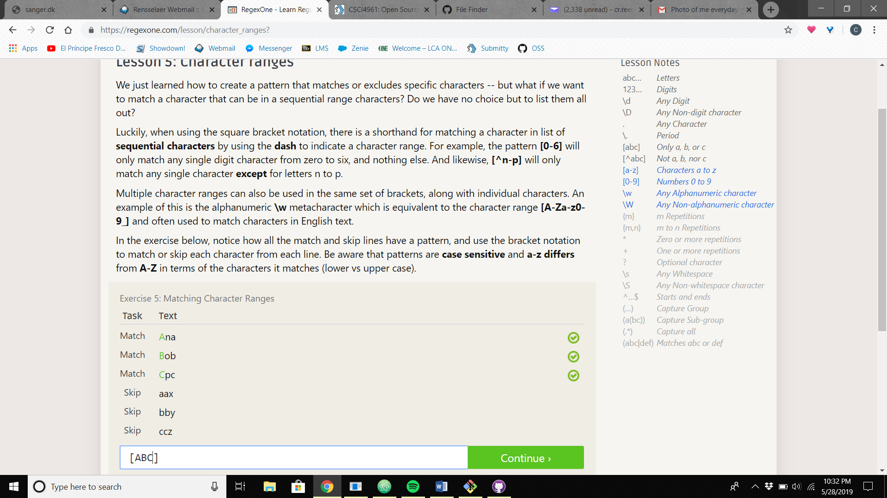
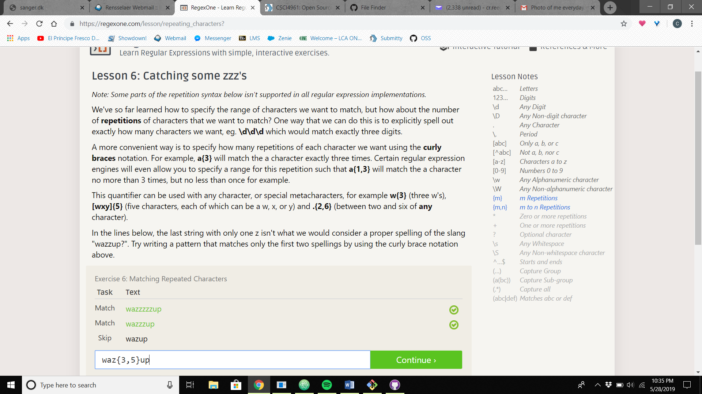
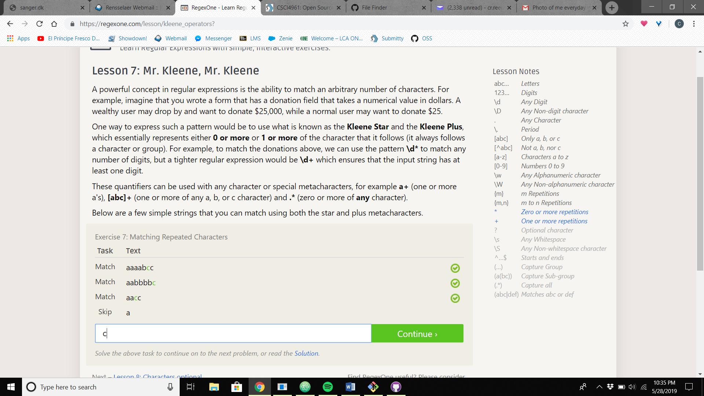
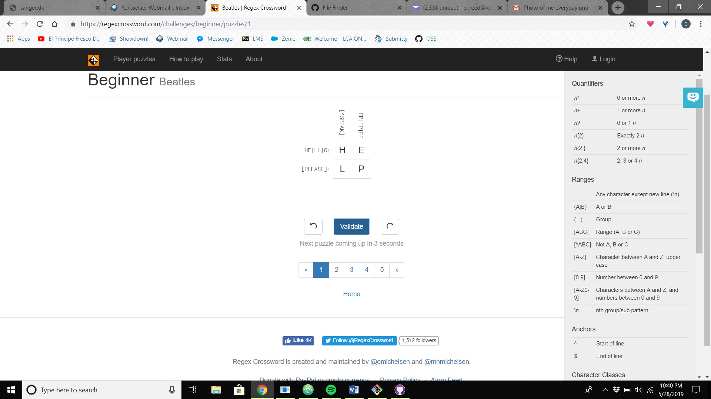
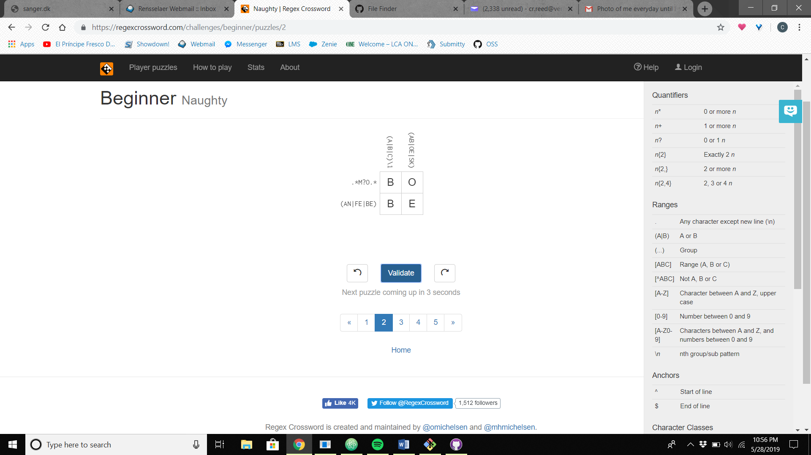
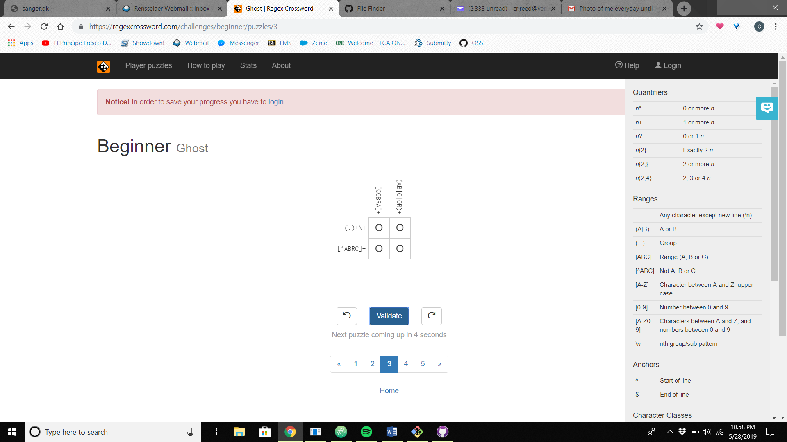
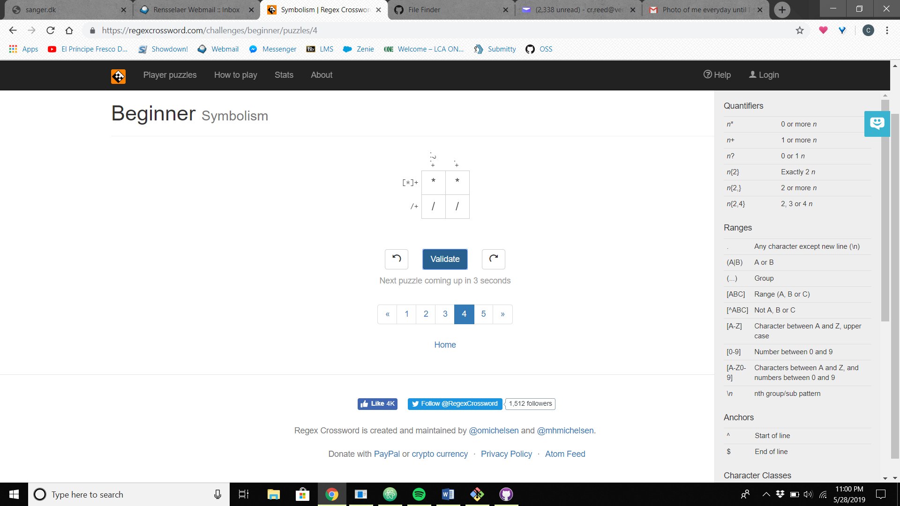

# Lab 01 Report - Introduction to Open Source Software

### Reading Assignments

##### Open Source Definition

It is important to have the definiton of open source to be clear and well defined.  Open source is something that anyone can use, and how you use the source is up to your interpretation.  This leaves a lot of power to the user, it is important however that the user does not then use their power to restrict the abilities of other people to use the open source that the original user found by fair measure.  Having all of the specfication be clearly defined with muliple examples and clauses prevents any loop holes or means of exploitation on any fronts.

##### Smart Questions

1. A great way to better understand a question that someone might be asking would be to rephrase it to them to gauge yourunderstanding of what they are asking.

2. Sometimes resources that have the answer that this person is loking for can be really accessable but uses jargon that the person looking for answers does not understand.  Even if you find the answer in a quick google search.  Provide the link and some explanation as to how to decipher the answer out of the text.

##### Free Culture

What I got out of this article is that big industries continue to find ways to exploit people.  Industries have a lot of power to do as they please because they can afford to do whatever they want.  They can afford expensive lawyers and can file large law suites without batting an eye at expenses or costs.  This also reaffirms the need for the protection of the creator and the tinkerers like Jesse.  As mentioned in the article, this could happen to any student here at RPI, we are taught to tinker, and question the already established foundations to find better solutions.  The dilema I have with this situation is that even if Jesse didn't know that his search engine could be used to perform illegal acts, there is no way to know his true intentions.  The other crazier aspect is that people can take what you made for pure reasons and corrupt it, with only you to blame.  This situation is all around tragic and was not necessary especially for a college student with apparent good intentions.

### Regex

### Crossword

### Blocky

### Reflection
