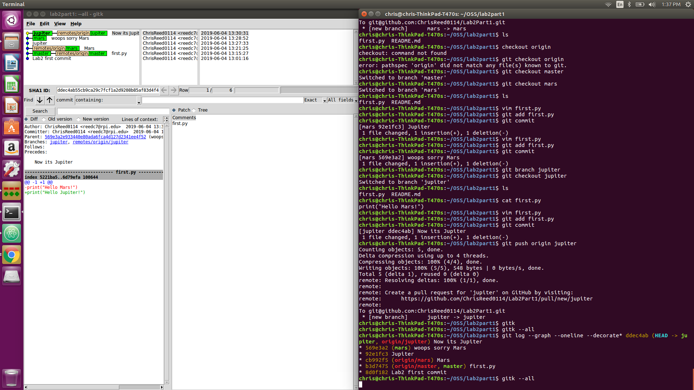
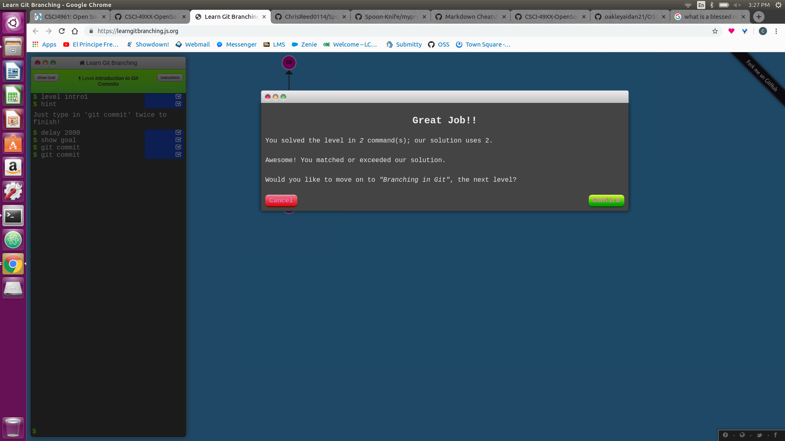
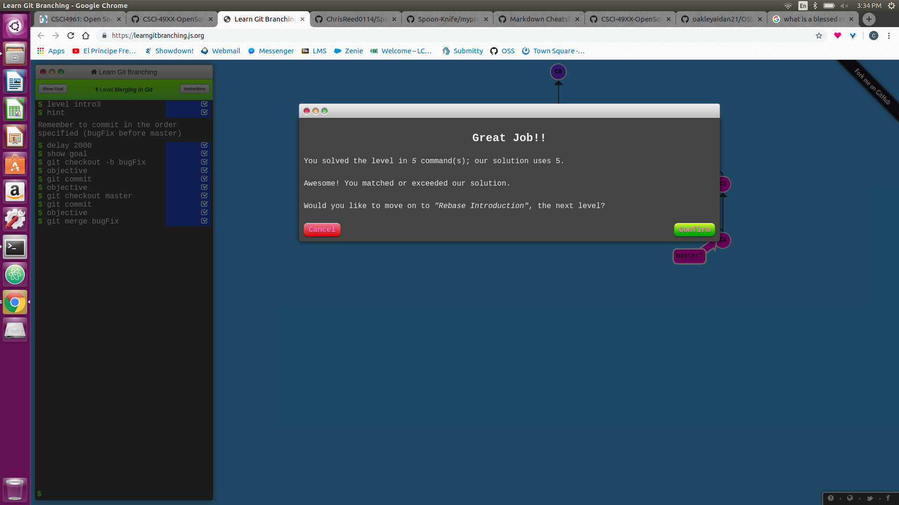
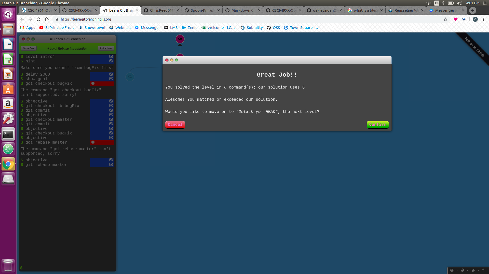
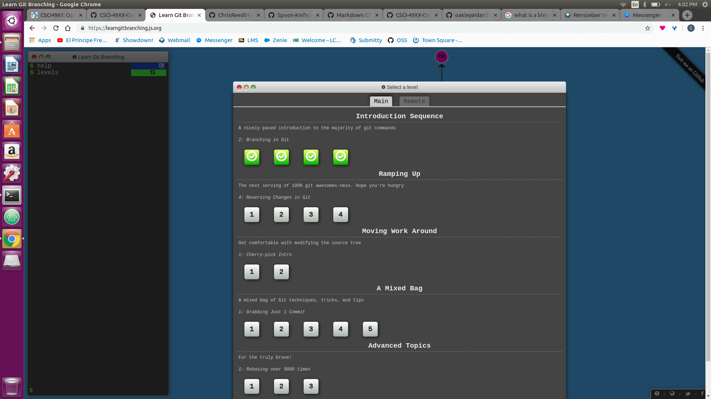
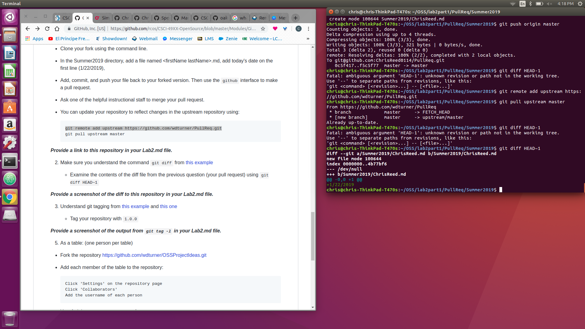

# Lab 2 - Introduction to Git

### Lab 2 Part 1

https://github.com/ChrisReed0114/Lab2Part1

### Gitk vs. Git Log

### Spoon Knife

https://github.com/ChrisReed0114/Spoon-Knife

### PullReq

https://github.com/ChrisReed0114/PullReq

### Learn Git Branching

### Git Diff

### Tagging

### Group 5 Project Ideas

https://github.com/oakleyaidan21/OSSProjectIdeas
