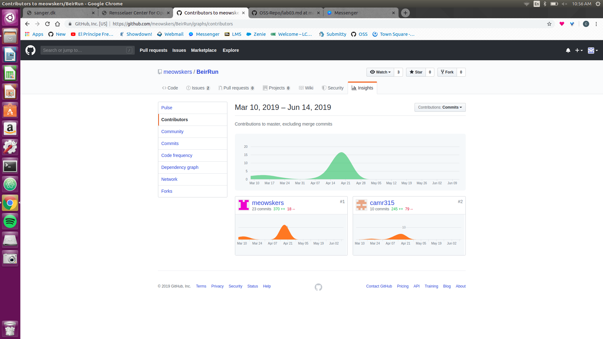
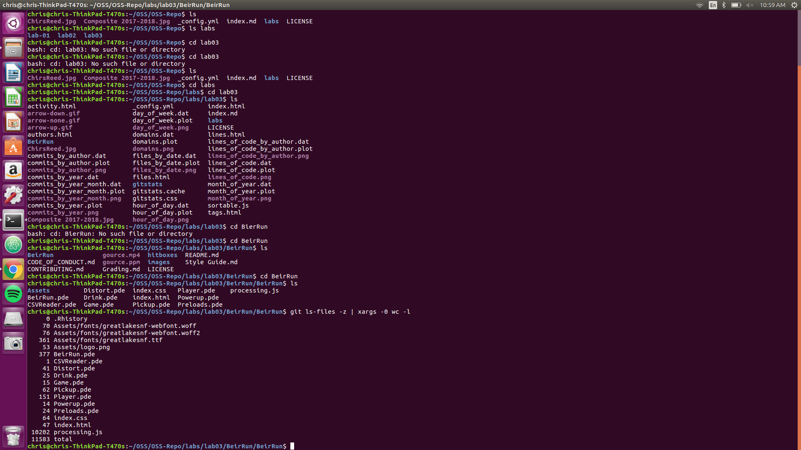
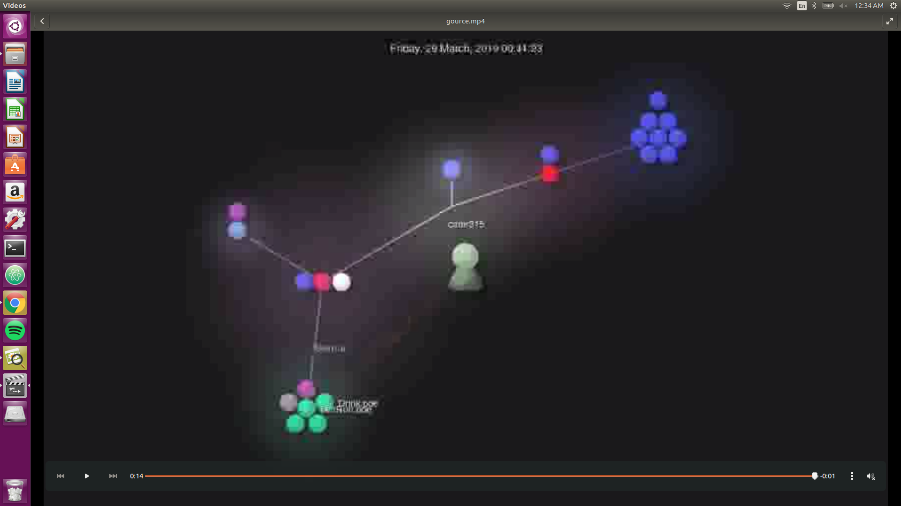

# Lab03 Documentation and Community

## Part 1 Documentation

### Mathematical Formulas

### Matrix

## Part 2 Community

### BeirRun

#### Project Stats

* Contributors: 2

* Lines of code: 14225

* First commit: 4/26/2019

* Latest commit: 

* Current branches: 

#### Gitstats

#### Gource

https://www.youtube.com/watch?v=5lkSEWa4biQ
