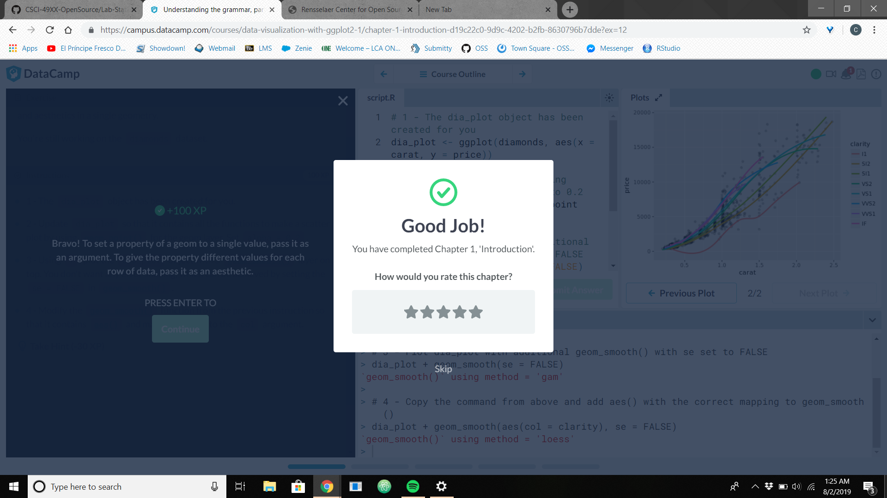
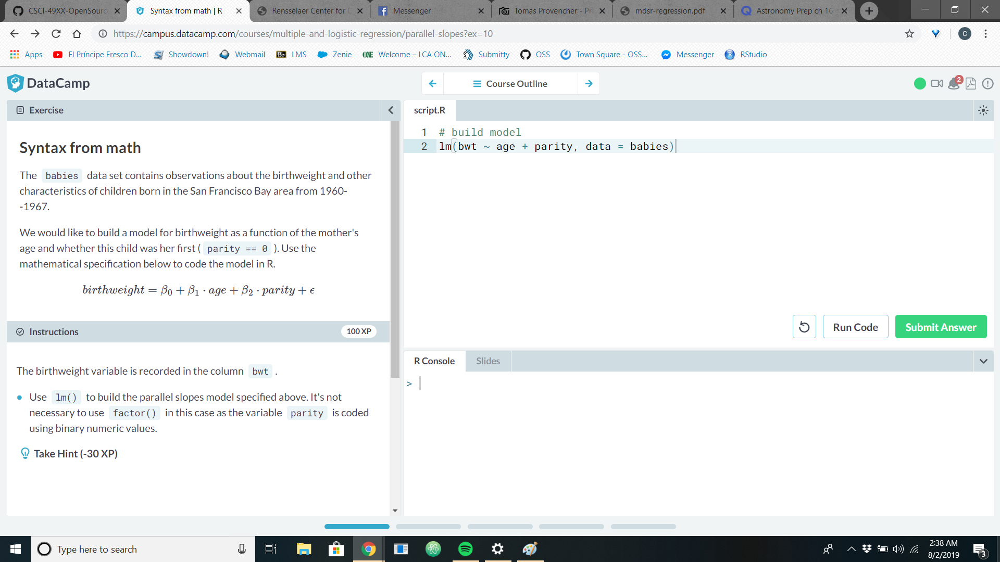

# Statistical Computing Lab
## Chris Reed

### Data Visualization with ggplot2 (Part 1)

### Multiple and Logistic Regression
#### I had problems with my computer and finished but then I lost the completed notification after it restarted on its own

### Flom

#### Project Page

https://rcos.io/projects/flomv2/flom/profile

#### Communication Channel: Mattermost

https://chat.rcos.io/oss-summer2019/channels/flom
