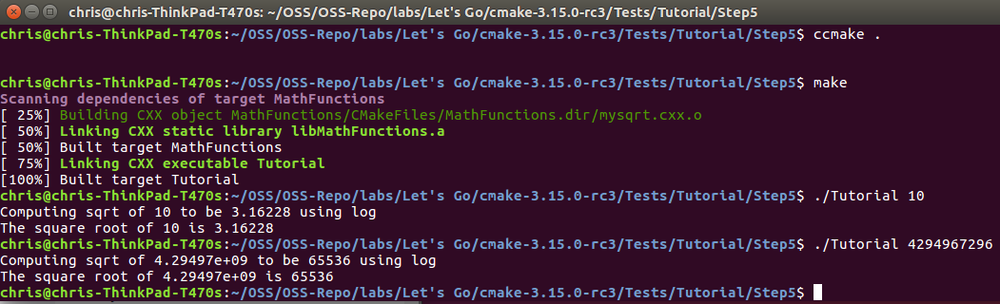

# Lab 5 - Build Systems
## By Christopher Reed

### Step 1

#### tutorial.cxx

#### CMakeLists.txt

#### Running Tutorial

### Step 2

#### tutorial.cxx

#### CMakeLists.txt

#### Running Tutorial

### Step 3

#### CMakeLists.txt

#### MathFunctions/CMakeLists.txt

#### Running Tutorial

### Step 4

#### CMakeLists.txt

#### MathFunctions/CMakeLists.txt

#### Running ctest -VV

### Step 5

#### CMakeLists.txt

#### MathFunctions/CMakeLists.txt

#### Running Tutorial

